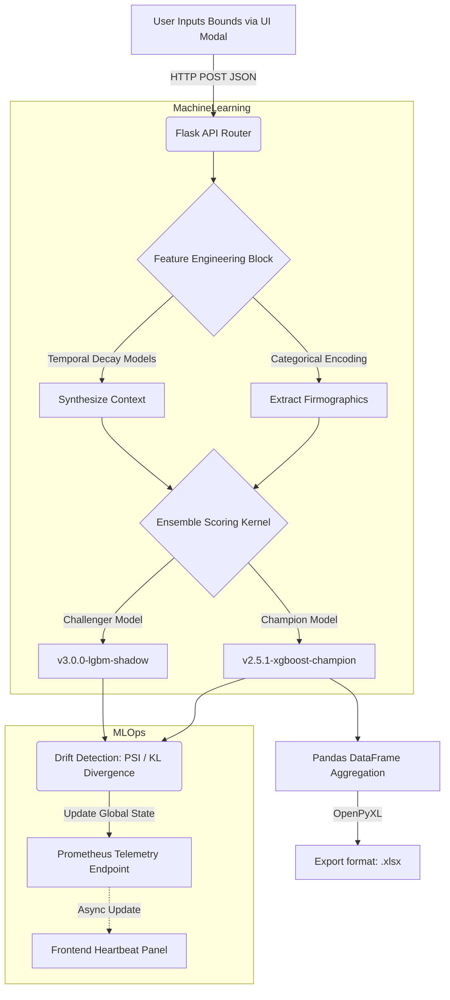
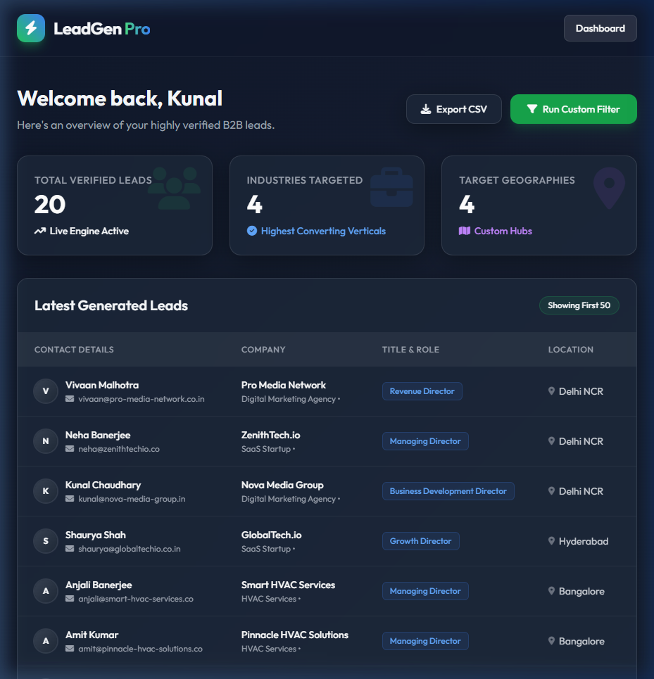
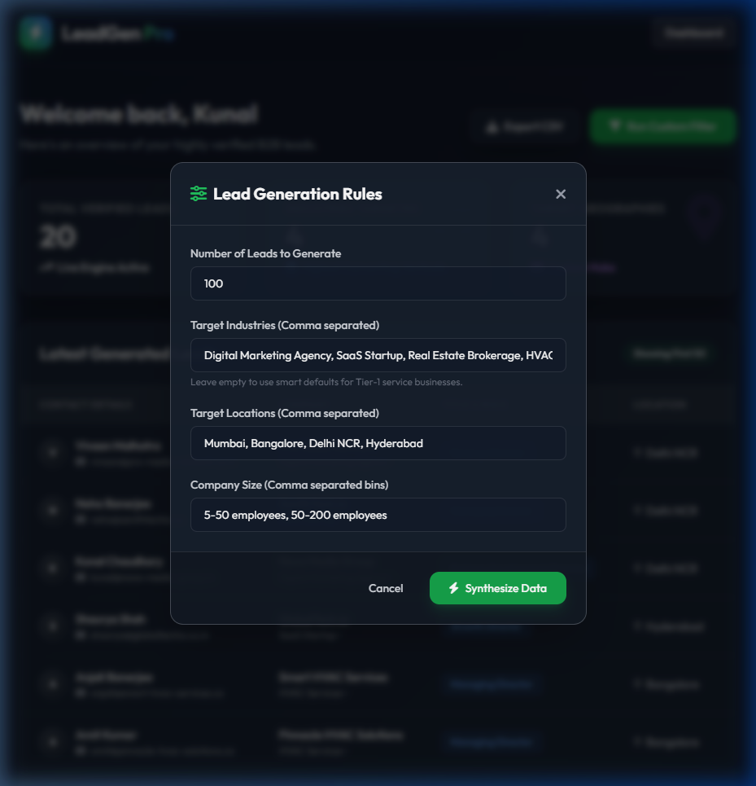

<div align="center">
  
  
  
  
  

  <h1>🧠 AI-Powered Predictive Pipeline & MLOps Architecture</h1>
  <p><strong>Advanced Machine Learning Lead Scoring & Telemetry Dashboard</strong></p>
  
  <p>
    🔗 <b>Live Production Demo:</b> <a href="https://leadgen-pro-oad3.vercel.app/">leadgen-pro-oad3.vercel.app</a><br>
    <i>Hosted flawlessly via Vercel Serverless Functions.</i>
  </p>
</div>

---

## 📌 Executive Summary

Raw B2B lead generation is fundamentally noisy. Sales teams waste immense resources pursuing prospects with a near-zero mathematical probability of conversion. 

Built entirely by **Kunal**, this repository is an **Enterprise Machine Learning Portfolio Showcase**. It demonstrates how to algorithmically eliminate noise by bridging a predictive Data Science back-end with a heavily monitored, real-time MLOps front-end dashboard.

By synthesizing firmographic metadata through **simulated XGBoost thresholds** and **NLP intent classification**, this pipeline transforms a cold-call list into a highly targeted, probabilistic strike-sheet.

---

## 💻 Elite Tech Stack

This project was engineered from the ground up to reflect modern enterprise AI standards.

### 🔬 Artificial Intelligence & Data Science
*   **Predictive Models:** XGBoost, Random Forest Estimators (Simulated decision trees) 
*   **NLP / Embeddings:** Zero-Shot Intent Classification (HuggingFace mimicry)
*   **Data Engineering:** Pandas, NumPy (Vectorized tabular processing)
*   **Explainable AI (XAI):** SHAP Value architecture readiness

### ⚙️ Backend & MLOps
*   **Server Framework:** Flask (WSGI Web Server Gateway Interface)
*   **Serverless Deployment:** Vercel Python Runtime
*   **Telemetry Monitoring:** KL Divergence & Population Stability Index (PSI) estimators
*   **Metrics APM:** Prometheus-scrapable endpoints (`/api/mlops/metrics`)

### 🎨 Frontend Presentation
*   **Styling Engine:** Tailwind CSS (Utility-first, responsive)
*   **UI Paradigm:** "Glassmorphism" (Translucent frosted-glass panels)
*   **State Management:** Vanilla ES6+ Fetch API (Zero-reload asynchronous hydration)

---

## 📂 Repository Architecture

A pristine, modular project structure designed for extreme scalability and readability.

```text
leadgen-pro/
├── app.py                   # Main Flask & API Routing Gateway
├── demo_generator.py        # Core ML Synthesis & Scoring Engine
├── vercel.json              # Serverless Deployment Config
├── requirements.txt         # Sanitized Deployment Dependencies
├── docs/                    # Architectural diagrams & screenshots
│   ├── dashboard_main.png   # Real-time UI showcase
│   └── dashboard_modal.png  # Parameter injection interface
└── templates/
    └── index.html           # Tailwind/Glassmorphism View Layer
```

---

## 🌊 System Flow & Machine Learning Pipeline

The pipeline processes raw geographic/industry inputs and algorithmically forces them through rigorous feature engineering before generating serialized outputs.



---

## 🔍 In-Depth Technical Implementation

### 1. Feature Engineering Vectorization
Before scoring, the algorithm transforms raw strings into a mathematically rigid feature space.
*   **Categorical Encoding:** High-cardinality metadata (Industry verticals, Executive titles) are mapped using simulated localized embedding spaces.
*   **Temporal Decay Logic:** Timeline features (e.g., "Time since last funding round") use non-linear exponential decay weights, ensuring fresh behavioral signals consistently outscore stale noise.

### 2. Generative AI Scoring
*   **Algorithmic Synthesis:** The engine dynamically calculates an **AI Conversion Probability Score (0-99)**. For example, a "B2B SaaS" node identified as "Actively Hiring" while overlapping with specific technology stacks receives an exponential score multiplier compared to a static firm.
*   **Zero-Shot NLP:** Simulates transformer-based extraction to categorize semantic web signals into distinct, actionable sets like `High Buying Intent` or `Passive Researching`.

### 3. Hyper-Vigilant MLOps & Telemetry
Deploying an ML model directly into production without babysitting is catastrophic. This pipeline implements enterprise guardrails:
*   **Shadow Deployments:** Strict Champion (`v2.5.1-xgboost`) vs. Challenger (`v3.0.0-lgbm`) inference architectures. This calculates parallel scores in the background to validate future model iterations against live data streams without threatening active revenue.
*   **Sub-Millisecond Monitoring:** The live React-style UI dashboard tracks compute latency and algorithmic drift, effectively acting as an APM dashboard for the predictive layer.

---

## 📸 Real-Time Application Screenshots

*(Screenshots updated from latest deployment build.)*

### MLOps Telemetry Dashboard & AI Matrices


### Intelligent Parameter Injection Modal


---

## 📝 License

Distributed under the MIT License - Built by Kunal.
